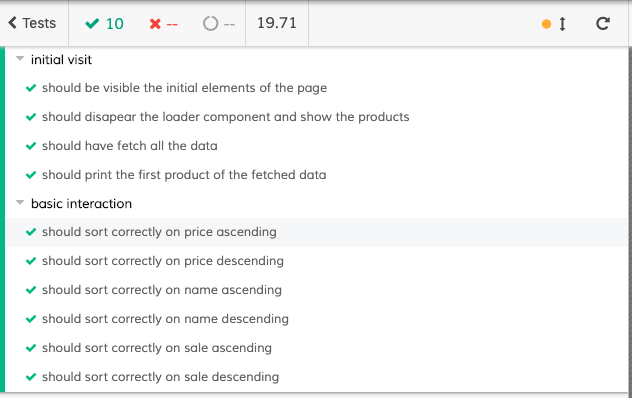

# XXXLutz Product List Challenge

This is my code proposal to solve the challenge to fetch data and print the information on the browser. 

You can see the final result [here](http://produktlista-challenge.surge.sh/)

## Introduction

The product owner wants you to implement a search result page for XXXLutz (Sweden):

The initial data is organised as a JSON object and can be fetched from https://api.myjson.com/bins/rl7ac (the API is CORS enabled). It contains 100 products and all required information you will need.

Implement the product list in React considering the following requirements:

Write pure/stateless components wherever possible
the layout should be fully responsive, please find a suitable way to arrange the information accordingly
size of the page and required resources are important, be cautious with the resulting bundle size
implement lazy loading of images
optional: add sorting functionality for price, popularity and name

## Result

## Instalation

Install the depencies:

`npm i`

Run the app on localhost:8080

`npm run dev`

Build the app to production:

`npm run build`

Lint your code with [StandardJS](https://standardjs.com/)

`npm run lint`

## Testing

To test the components I decided to use cypress js. Cypress is a Javascript end to end tool to test your Client-Side components.

To run the test

`npx cypress run`

To open the cypres CLI (recommended option)

`npx cypress open`

You can find more information [here](https://www.cypress.io/).

## Technologies

* [Webpack](https://webpack.js.org/)
* [Babel](https://babeljs.io/) 
* [React](https://reactjs.org/)
* [StandardJS](https://standardjs.com/)
* [Axios](https://github.com/axios/axios)
* [Styled-Components](https://www.styled-components.com/)
* [intersection-observer](https://github.com/w3c/IntersectionObserver)
* [Cypress](https://www.cypress.io/)
* [Surge](https://www.surge.sh/)
